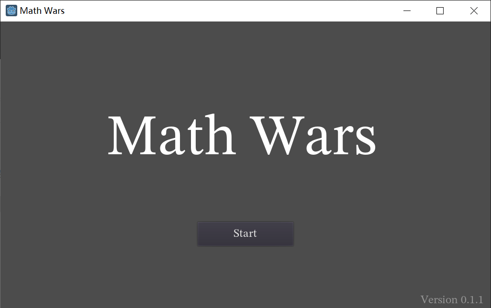
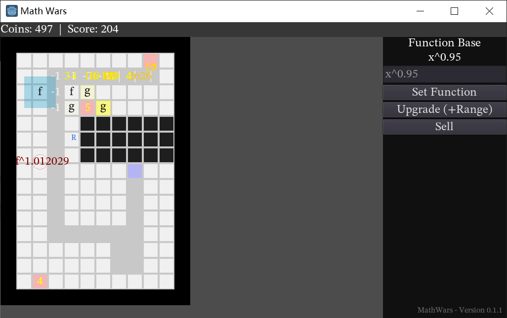

# Math Wars

A different tower defense game, designed for math enthusiasts.

The main game logic is written entirely in GDNative C++. ([Godot Engine](https://godotengine.org/) 3.5)

*Version 0.1.1, Copyright (C) 2022  FiftysixTimes7*

## Tutorial

- The goal of this game is to survive longer and to reach a higher score, so there's no end or winning for this game.

- Numbers can only be killed by **Decreasers**.

- Each Number killed will be awarded for 5 coins and 1 score.

- Each Number reaching the end of the path will steal corresponding amount of coins.

- When your coin count is less than 0, you lose.

### Numbers

- Numbers are the main enemies you have to deal with.

- They can be affected by **Decreasers**, **Enemy Functions (Type A)** and **Splitters**.

### Decreasers

- Decreasers decreases every number by its amount.

- Decreasers can be affected by **Function Bases** (if it's within a base's range).

- Each decreaser **applies the function set in a base** before it finally decreases numbers by its amount.

- You can upgrade a decreaser to increase its amount.

### Function Bases

- The function set in a base is affected on numbers by decreasers in its range.

- **Note that you should always set functions smaller than "x"** (such as "0.9*x" or "x^0.9").

- Expressions are internally parsed using [TinyExpr](https://github.com/codeplea/tinyexpr), thus this game only supports expressions compatible with it.

- You can upgrade a base to increase its range.

- Function Bases can only be attacked by **Enemy Functions (Type B)**.

### Enemy Functions (Type A)

- Targeting **Numbers** to give them a bonus.

### Enemy Functions (Type B)

- Targeting **Function Bases** to modify the functions set in bases.

- They are more dangerous than Type A in mose cases.

### Reverse Function Generators

- Generate reverse functions that can neutralize enemy functions.

- You can upgrade them to decrease cooldown time.

### Splitters

- Splitting the passing **Numbers**.

- You can adjust the proportion of the split numbers.

- They are powerful, but also expensive.

## License

This project is licensed under GPL-3.0 or later.

**PLEASE DO NOT EXACTLY COPY THIS GAME FOR ANY COURSE PROJECT AT SCHOOL.**

This project takes advantage of [Godot Engine](https://github.com/godotengine/godot) (MIT License) and [TinyExpr](https://github.com/codeplea/tinyexpr) (Zlib License). Thanks for the great contributions of their developers.